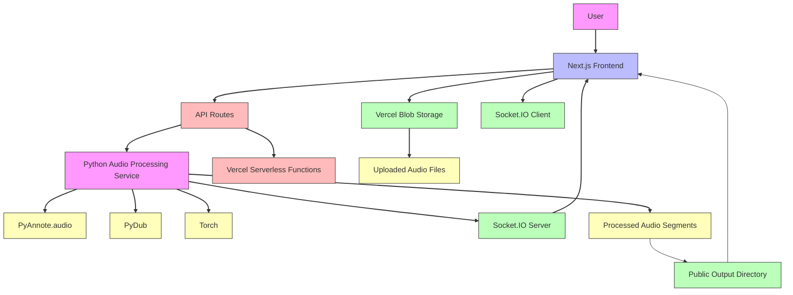

<p align="center">
    <picture>
        
    </picture>
</p>
<p align="center">
    <a href="https://diarisator-ai.vercel.app">官方网站 (Official Website) 🌐</a>
    <br>
    <a href="https://github.com/RichardJiang736/DiarisatorAI">代码仓库 (GitHub Repository) 💻</a>
    <br>
</p>

<h1 align="center">彝族语言与文化保护的声音分离工具</h1>

🌏 **缘起：从一次前往凉山彝族自治州的旅程**

一次前往凉山彝族自治州的旅程，成为了这段故事的起点。
那是一段难忘而珍贵的经历。

在短短几公里的地理跨度中，彝族人民却展现出截然不同的文化习俗与语言特征。尤其是他们所使用的语言——既神秘、又复杂、同时充满魅力。作为一名有幸参与的观察者与学习者，我与语言学专家们一同努力，尝试理解并记录这种正在消逝的语言。

**语言不仅仅是交流的工具，更是人类文明的基石。**
它承载着记忆、传承与身份认同。每一种语言的消失，都是人类共同遗产的缺失。保护语言，就是保护我们自身的一部分。

---

## 💡 为什么需要 DiarisatorAI

在文化保护的过程中，我们遇到了一个亟需解决的问题：
**如何有效地记录、分离并整理口头语言，尤其是民歌与口述传统？**

彝族民歌往往长且连续，句子之间难以分辨，这使得翻译、研究与保存极具挑战性。于是我们开发了 **DiarisatorAI** ——一个基于 **说话人分离（Speaker Diarisation）** 技术的应用，它不仅能识别不同的说话人，还能将长篇音频精准切分成更小的片段，便于后续翻译与整理。

这一工具的意义，不仅在于技术本身，而在于它成为了**文化传承的桥梁**：

* 让语言学家更高效地分析语料
* 让公众更容易接触和理解这些独特的语言
* 为未来的文化保存留下原汁原味的记录

---

## 📌 我们已取得的进展

* 📚 **网络词库**：由梁仁俊及其团队开发，收录了超过 **一万条彝语-汉语翻译**
* 🤖 **AI 工具与原型界面**：能够将采集到的彝族民歌切分为独立的句子，后续可翻译为汉语，并计划发行成 **黑胶唱片**，在学术与大众文化中同时产生影响
* 🎥 **纪录片制作中**：整理拍摄素材，力求呈现出既易于理解，又极具人文关怀的作品

---

## 🔧 技术说明

**DiarisatorAI** 是一个基于 AI 的 **说话人分离与语音切分工具**，提供了直观的网页应用界面。

### 功能特点

- **说话人识别**：自动检测音频中的不同说话人。
- **音频分割**：将音频按说话人分割成独立的片段。
- **语言优化**：针对彝语等少数民族语言进行了特殊优化。
- **文化保护**：支持文化保护项目，如民歌的数字化和翻译。

### 技术栈

- **前端**：Next.js, React, TypeScript, Tailwind CSS
- **后端**：Node.js, Python
- **数据库**：Prisma, SQLite
- **AI模型**：PyAnnote.audio

### 架构图

下面是应用程序各模块之间的通信关系图：



* **项目链接**

  * 🌐 Web 应用：[diarisator-ai.vercel.app](https://diarisator-ai.vercel.app)
  * 💻 代码仓库：[GitHub Repo](https://github.com/RichardJiang736/DiarisatorAI)

### 🚀 安装和运行

```bash
# 克隆仓库
git clone https://github.com/RichardJiang736/DiarisatorAI.git
cd DiarisatorAI

# 安装依赖
python3.9 -m venv venv && source venv/bin/activate && pip install --upgrade pip && pip install pyannote.audio pydub torch && npm install

# 启动开发服务器
npm run dev
```

### ☁️ Vercel 部署

要将应用部署到 Vercel，您需要配置以下环境变量：

1. `BLOB_READ_WRITE_TOKEN` - Vercel Blob 存储的读写令牌，用于处理大文件上传
2. `PYTHON_SERVICE_URL` - Python 音频处理服务的 URL（可选，默认为 http://localhost:8000/process）

在 Vercel 项目设置中添加这些环境变量以确保应用正常运行。

注意：由于 Vercel 不支持 Python 运行时，音频处理部分需要部署到单独的服务上。
请参考 PYTHON_SERVICE.md 了解如何部署 Python 服务。

## 🌿 致谢

谨以此项目，感谢自 2023 年便投身于**文化与语言保护事业**的导师与前辈们。
是他们的坚持与指导，让我有机会将人工智能技术应用于这项极具意义的使命中。

愿此工具不仅服务于学术研究，也能成为连接文化、语言与人类共同记忆的纽带。
